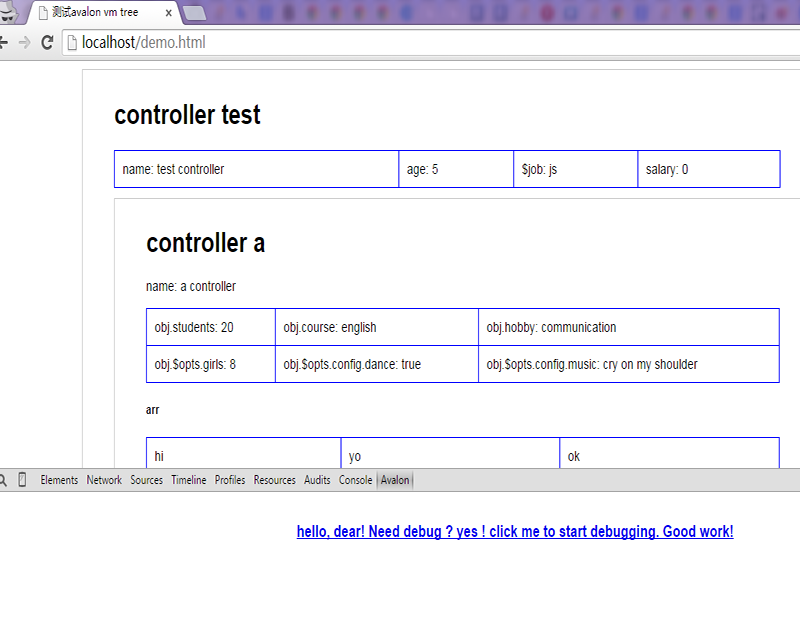
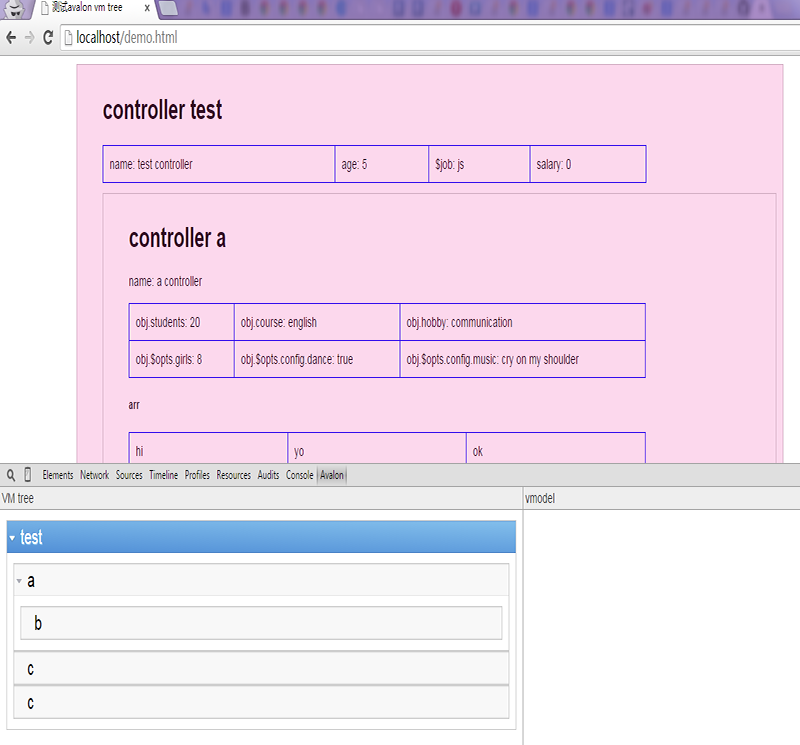
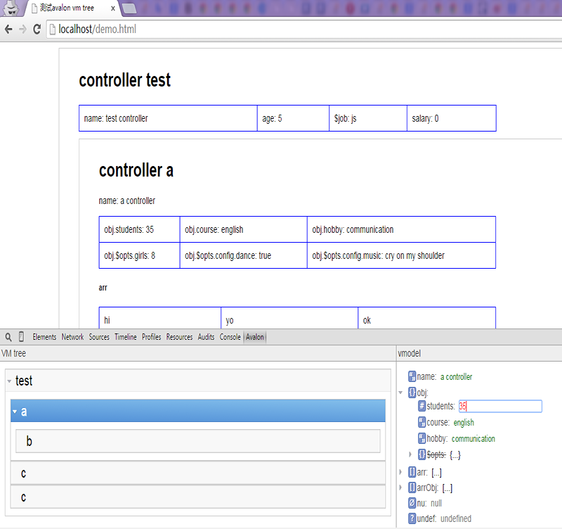
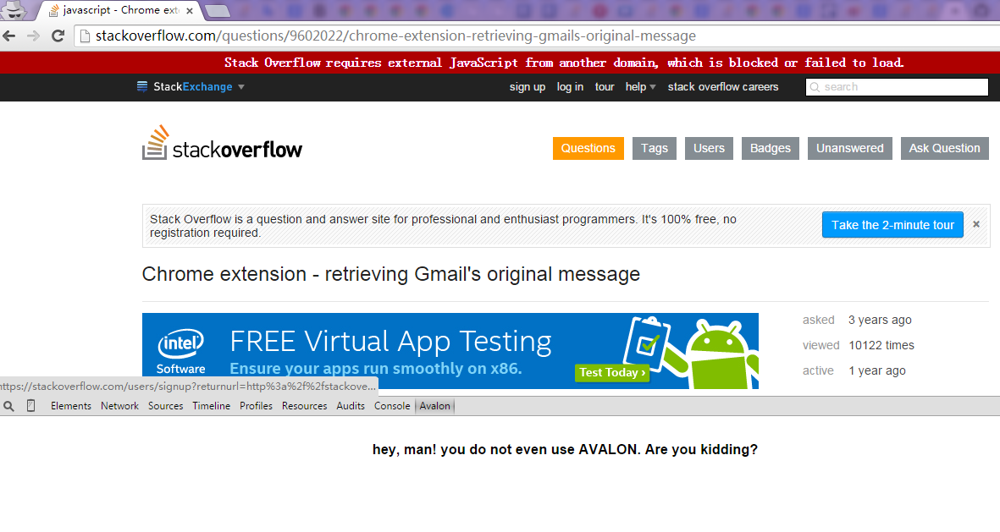

# Avalon Debugger

Chrome Developer Tools extension for debugging Avalon.js applications.

Install from source
--------
Using Google Chrome:
* [Download the project archive](https://github.com/shirlyLoveU/avalondebugger/archive/master.zip) and extract it somewhere.
* Click on Tools -> Settings -> Extensions
* Select "Enable developer mode" in the upper right of the window.
* Click on "Load unpacked extension".
* Select the extracted folder.
* Enjoy!

Screenshots
--------
**Avalon devtool**:

**Avalon VM tree**:

**Avalon vmodel debug**:

**Do not use avalon**:

