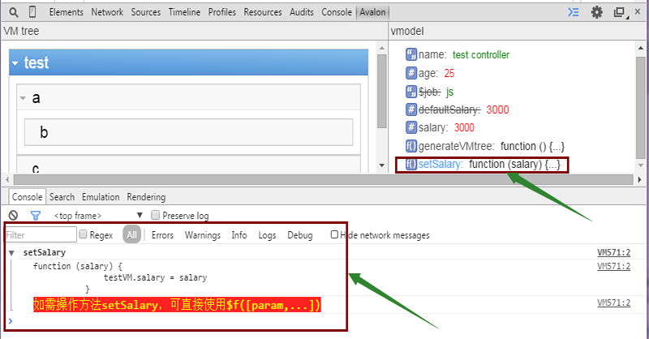

# avalon debugger

> 基于chrome的扩展工具，用来直观的查看页面VM的嵌套关系，方便的进行avalon的调试


## 安装

从github上下载[avalon debugger](https://github.com/shirlyLoveU/avalondebugger/archive/master.zip)解压

打开chrome浏览器，地址栏输入：**chrome://extensions**打开chrome的扩展程序

勾选右上角的**开发者模式**

将解压的**avalon debugger**目录文件拖放到扩展程序页即可完成安装


## 使用

成功安装**avalon debugger**之后，打开一个使用avalon的页面，**F12**打开chrome的调试控制台找到**Avalon**


切换到Avalon panel，提示我们开启avalon调试，**点击链接开启avalon调试功能**


开启调试之后会将页面上的VM controller按其嵌套关系展现在Avalon panel中的**VM tree**区域，可以展开、收起嵌套较深的VM

**注:** 每个VM面板的header部分代表对应VM的id，可以通过**avalon.vmodels[id]**获取对应的Vmodel 


鼠标**悬停**在对应的VM上时页面上会标出其作用的**DOM范围**


点击对应的VM会在Avalon panel右侧的**vmodel**区域展示对应VM具有的数据结构，其中不可监控的数据属性用**删除线**标志，可监控的number、boolean、string类型属性可**直接调试**，且不同的数据类型通过不同的**color**和**icon**标志

以**test** vmodel为例，**test**的定义如下：

```javascript
  avalon.define('test', function(vm) {
    vm.name = 'test controller'
    vm.age = 5,
    vm.$job = 'js'
    vm.$skipArray = ['defaultSalary']
    vm.defaultSalary = 3000
    vm.salary = 3000
    vm.generateVMtree = function() {
        console.log('this : ')
        console.log(this)
        alert("当前页面使用的vmodels : " + Object.keys(avalon.vmodels))
    }
    vm.setSalary = function(salary) {
        testVM.salary = salary
    }
  })
```

可见其中**$job**和**defaultSalary**是不可监控属性：


对于可监控的age、name、salary我们都可以直接调试, 以**test**的**age**属性为例，默认为**5**，我们将其修改为**25**：


**age**属性设置值**25**回车之后，**age**自动更新:


如果需要调用VM的方法进行调试，只需点击对应的**function name**，就可以在**console**控制台下看到对应方法的**实现**，并且该方法可在console控制台下通过**$f**引用，调用**$f()**即执行对应的方法

以上面定义的**test VM**的**setSalary**方法为例，点击**setSalary**后console控制台的显示如下：



调用**$f**方法，同时传入**5000**来修改**salary**，可以看到页面**salary**的变化：


如果不确定Avalon panel中vmodel展示的信息是否正确，可以根据VM tree区域展示的VM id手动在console控制台调用avalon.vmodels[id]来查看VM

### 最后的说明

如果程序内容修改了VM的属性或者页面上的操作(绑定ms
-duplex)更新了VM的属性,Avalon panel中vmodel区域展示的内容可能**过旧**，这时只需要再次点击VM tree区域对应的VM即可得到**更新后的数据**

截图中的**[demo.html](./demo.html)**页面在avalon debugger中有提供，可以直接从debugger的解压目录中打开此测试页面进行上述测试

